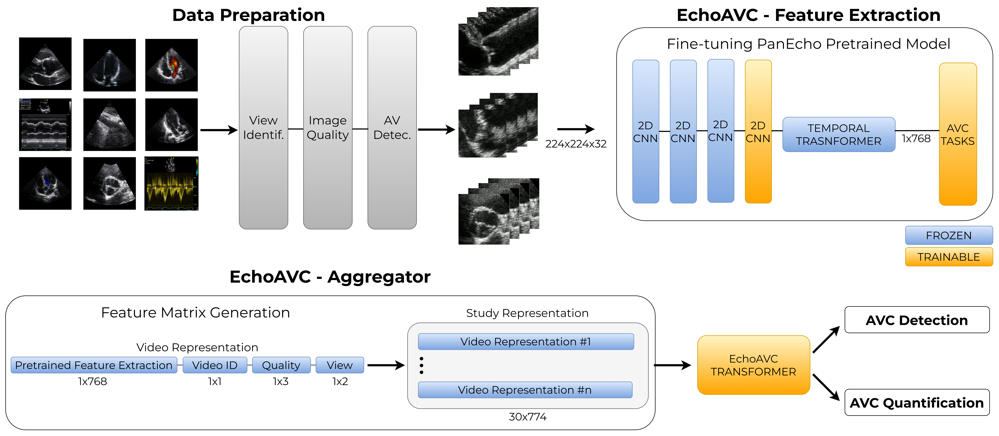

# EchoAVC: Artificial intelligence for aortic valve calcium score quantification by echocardiography

EchoAVC is a framework for accurate, non-invasive detection and quantification of aortic valve calcification (AVC) using echocardiographic videos.



## Repository Structure

- **preprocessingDCM**: Converts echocardiography studies from DICOM (DCM) format to AVI. Requires a source folder (`root_folder`) containing DICOM files and an output folder (`root_out_folder`) where the converted AVI files will be saved. Use the conda environment defined in `prepro.yaml`.
- **AVdetection**: Detects the aortic valve (AV) in echocardiography images.
- **EchoQuality**: Classifies echocardiography quality. The model is fine-tuned from [CarDS-Yale/PanEcho](https://github.com/CarDS-Yale/PanEcho), and part of the code is adapted from that project.
- **EchoAVC**: Identifies and quantifies aortic valve calcium. Feature extraction builds on [CarDS-Yale/PanEcho](https://github.com/CarDS-Yale/PanEcho); to aggregate video-level features at the study level, a transformer-based architecture is used.

## Model Weights

- EchoQuality weights: https://huggingface.co/perolope/EchoQuality  
- AV detection weights: https://huggingface.co/perolope/AVdetector  
- EchoAVC weights: https://huggingface.co/perolope/EchoAVC

## Getting Started

### 1. Clone the repository:
```bash
git clone https://github.com/CardiovascularImagingVallHebron/EchoAVC.git
cd EchoAVC
```

### 2. Preprocessing DICOM to AVI

1. Create a conda environment from `preprocessingDCM/prepro.yaml`:
   ```bash
   conda env create -f preprocessingDCM/prepro.yaml
   conda activate prepro
   ```
2. Prepare your input folder (`root_folder`) containing DICOM files.
3. Specify an output folder (`root_out_folder`) where converted AVI files will be saved. Inside this folder, the script will create:
   - `vids_resized`: Videos cropped to the aortic valve cone and resized to 256x256.
   - `vids_cropped`: Videos cropped to the aortic valve cone at original resolution.
4. Run the preprocessing script (see `preprocessingDCM` for specific instructions).

For the following steps, create the conda environment from `AVdetection/torchone.yaml`:
   ```bash
   conda env create -f AVdetection/torchone.yaml
   conda activate prepro
   ```
### 3. Aortic Valve Detection

1. In `AVdetection/inference_avcrop.py`, set `base_dirs` to the `vids_cropped` folder created in the previous step.
2. Prepare a view probability file (`probs.csv`) similar to the example provided in the repository. This file contains the probability of each view being the aortic valve view.
3. Set `output_csv` to specify the output file path. The script will return the bounding box coordinates (in 256x256 resolution) of the aortic valve across different frames.
4. Run the inference script to detect aortic valve locations.

### 4. Echo Quality Assessment

1. Prepare an input file similar to `EchoQuality/content/test.xlsx` with paths to videos in the `vids_resized` folder (full cone videos, not valve-cropped).
2. Run the quality classification script, which will output video-level quality results to a specified file.

### 5. Aortic Valve Calcification (AVC) Quantification

#### Step 1: Video Feature Extraction

1. Run `EchoAVC/1_video_feature_extraction.py`.
2. Set `root_dirs` to the directory containing valve-cropped videos (from `vids_cropped`).
3. The script will output embeddings to `dest` folder: `data/row_pretrain_embeddings` containing 768-dimensional embeddings for each video.

#### Step 2: Build Study-Level Matrices

Construct a matrix for each study by concatenating:
- 768-dimensional embeddings (from Step 1)
- Video ID (1 dimension)
- Video quality score from EchoQuality (3 dimension)
- View identifier as one-hot encoded ("PSAX": 0.0, "PLAX": 1.0, "3CH": 2.0) (2 dimensions: view+probability)

This results in **774-dimensional feature vectors per video**. Concatenate up to 30 videos per study, creating **30×774 matrices** for each study.

#### Step 3: Study-Level Inference

1. Run `EchoAVC/2_matrix_inference.py`.
2. Provide:
   - Directory path containing the study-level matrices created in Step 2.
   - Study information file similar to `EchoAVC/content/info_csv.csv`.
3. The script will output AVC quantification results at the study level.

### 6. Download model weights from the links above as needed for each module.
